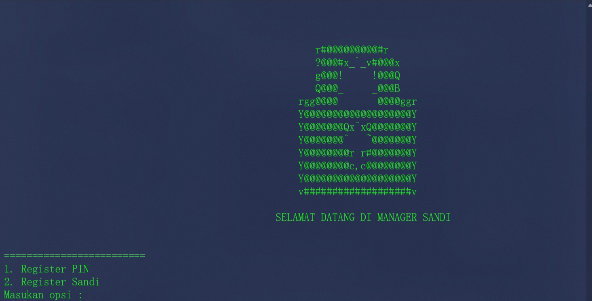
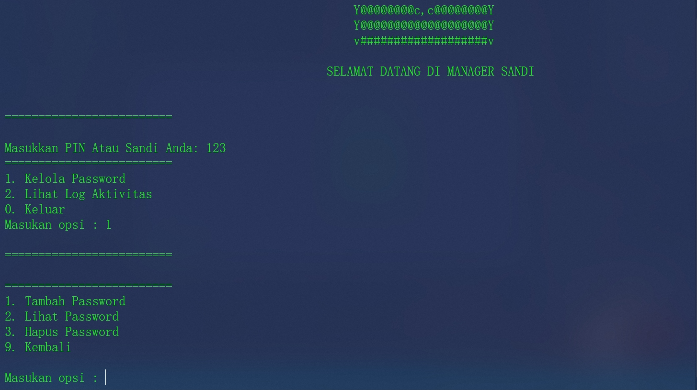
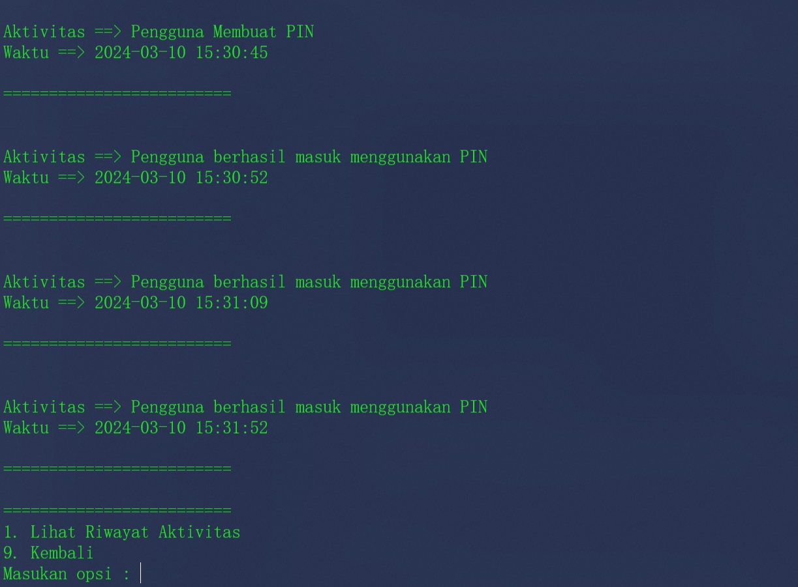

# My Password Manager

My Password Manager is a secure and easy-to-use password management application. This application allows you to store and manage all your passwords in one secure place.

## Features
- Store and manage passwords
- View activity log
- Authenticate via PIN or password




## Requirements

- Python 3.6 or newer
- Python Modules: `cryptography`

## Installation

1. Make sure you have Python 3.6 or newer installed. You can download Python from the official Python website.

2. Install the required Python modules by running the following command in your terminal:

    ```bash
    pip install --upgrade setuptools
    pip install cryptography
    ```

3. Download or clone this repository.
4. Open a terminal and navigate to the directory where you saved this repository.
5. Run the following command to install the application:
   
    ```bash
    python setup.py install
    ```

## Usage

1. Open a terminal and navigate to the directory where you saved this repository.
2. Run the application with the following command:
   
    ```bash
  python main.py
    ```

3. Follow the on-screen instructions to register and manage your passwords.